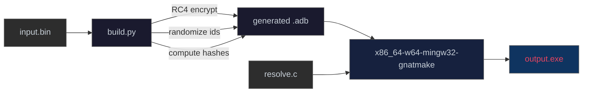
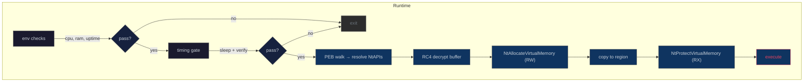
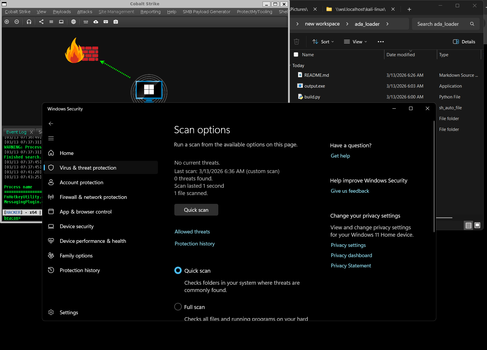

# Horus

x64 loader written in Ada + C. 

---

## How it works


```mermaid
graph LR
    A[input.bin] --> B[build.py]
    B -->|RC4 encrypt| C[generated .adb]
    B -->|randomize ids| C
    B -->|compute hashes| C
    C --> D[x86_64-w64-mingw32-gnatmake]
    E[resolve.c] --> D
    D --> F[output.exe]

    style A fill:#2d2d2d,stroke:#585858,color:#c9d1d9
    style B fill:#1a1a2e,stroke:#585858,color:#c9d1d9
    style C fill:#1a1a2e,stroke:#585858,color:#c9d1d9
    style D fill:#16213e,stroke:#585858,color:#c9d1d9
    style E fill:#2d2d2d,stroke:#585858,color:#c9d1d9
    style F fill:#0f3460,stroke:#585858,color:#e94560
```


```mermaid
graph TD
    subgraph Runtime
    G[env checks] -->|cpu, ram, uptime| H{pass?}
    H -->|no| I[exit]
    H -->|yes| J[timing gate]
    J -->|sleep + verify| K{pass?}
    K -->|no| I
    K -->|yes| L[PEB walk → resolve NtAPIs]
    L --> M[RC4 decrypt buffer]
    M --> N["NtAllocateVirtualMemory (RW)"]
    N --> O[copy to region]
    O --> P["NtProtectVirtualMemory (RX)"]
    P --> Q[execute]
    end

    style G fill:#1a1a2e,stroke:#585858,color:#c9d1d9
    style H fill:#16213e,stroke:#585858,color:#c9d1d9
    style I fill:#2d2d2d,stroke:#585858,color:#6c757d
    style J fill:#1a1a2e,stroke:#585858,color:#c9d1d9
    style K fill:#16213e,stroke:#585858,color:#c9d1d9
    style L fill:#0f3460,stroke:#585858,color:#c9d1d9
    style M fill:#0f3460,stroke:#585858,color:#c9d1d9
    style N fill:#0f3460,stroke:#585858,color:#c9d1d9
    style O fill:#0f3460,stroke:#585858,color:#c9d1d9
    style P fill:#0f3460,stroke:#585858,color:#c9d1d9
    style Q fill:#0f3460,stroke:#e94560,color:#e94560
```

---

## Features

| Feature | Detail |
|---|---|
| API resolution | PEB walking + DJB2 hash — zero suspicious IAT entries |
| Memory ops | `NtAllocateVirtualMemory` / `NtProtectVirtualMemory` resolved from ntdll at runtime |
| Encryption | RC4 with random 32-byte key per build |
| Anti-sandbox | CPU count, physical RAM, system uptime thresholds |
| Timing gate | Sleep + elapsed time verification (detects fast-forwarding) |
| Polymorphism | All identifiers, procedure names, key material randomized each build |
| IAT footprint | Only GNAT runtime imports (ADVAPI32, KERNEL32, msvcrt) — no VirtualAlloc, no CreateThread |

---

## Setup

```bash
# install dependencies (debian/ubuntu)
chmod +x install.sh && ./install.sh

# or manually
sudo apt install gnat gnat-mingw-w64 python3
```

Verify:
```bash
x86_64-w64-mingw32-gnatmake --version
python3 --version
```

---

## Usage

```bash
python3 build.py <input.bin>
```

Output: `output.exe`

Each run produces a completely different binary.

---

## Project structure

```
ada_loader/
├── src/
│   ├── loader.adb      # Ada template (build.py generates the actual source)
│   └── resolve.c       # PEB walker, API resolver, env checks
├── build.py            # build script — encrypts, randomizes, compiles
├── install.sh          # dependency installer
├── screenshots/        # scan results
└── README.md
```

---

## Screenshots

<p align="center">
  
</p>

---

## Technical notes

- The loader template (`loader.adb`) is never compiled directly. `build.py` reads it, replaces placeholders with encrypted data + computed hashes + random identifiers, writes a new `.adb`, compiles it, then deletes the generated source.
- `resolve.c` reads the PEB via raw x64 opcode bytes (no inline asm syntax issues across compilers). Module and function lookups use DJB2 on the export table names.
- Memory is allocated as `PAGE_READWRITE`, populated, then flipped to `PAGE_EXECUTE_READ`. No RWX pages.
- The binary imports `VirtualProtect` in its IAT — this comes from the GNAT Ada runtime, not from loader code. It's a normal import present in most Windows applications.

---

## Requirements

- Linux (WSL works)
- `gnat-mingw-w64` (Ada cross-compiler for Windows x64)
- `python3`

---

*For authorized testing only.*
